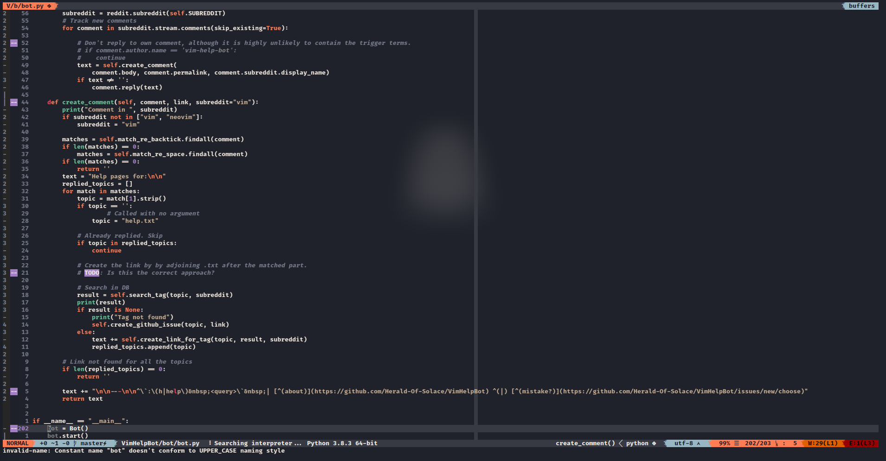
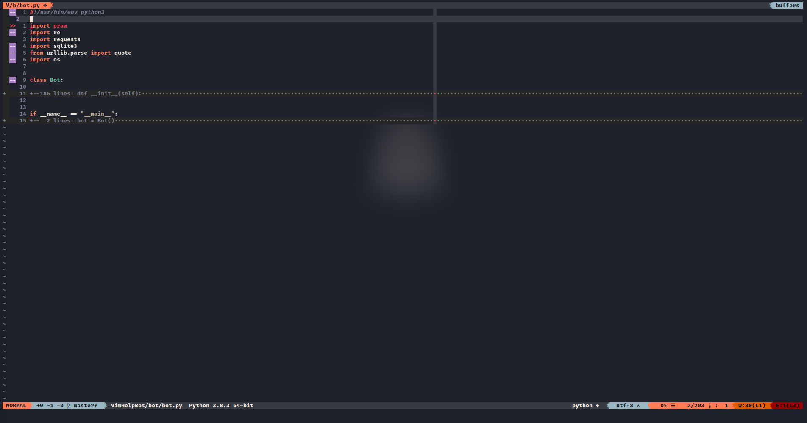
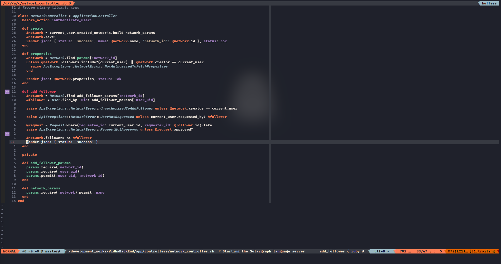
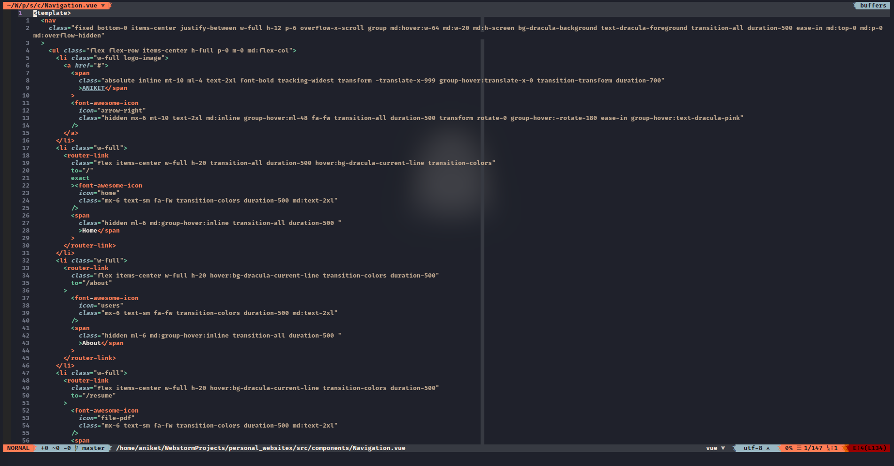

# Nisha colorscheme for Vim

This is a dark colorscheme for Vim with warm muted colours. 

## Installation

### With [Vim-Plug](https://github.com/junegunn/vim-plug):

```
Plug 'heraldofsolace/Nisha-Colorscheme', { 'rtp': 'vim' }
```
Then run `vim +PlugInstall`

For other plugin managers, take care of the 'rtp' value. You must add the `vim` folder to the rtp.

### Manual installation

1. Clone this repository.
2. Copy the `colors` folder to `.vim/colors`, or `.config/nvim/colors` if you use NeoVim.

## Activation

Set this as your colorscheme:
```
set termguicolors " This is needed if your terminal supports true colors
colorscheme nisha
```
## Airline

An [Airline](https://github.com/vim-airline/vim-airline) theme is already provided. If you installed Nisha with a plugin manager, you don't need to anything.

If you installed Nisha manually, copy the `autoload` folder to `.vim/autoload` or `.config/nvim/autoload` or anywhere in your `rtp`

Set the airline theme - 
```
let g:airline_theme='nisha'
```

## Screenshots

#### Python



#### Python (folded)



#### Ruby



#### Vue




## Light variant

Coming soon!
